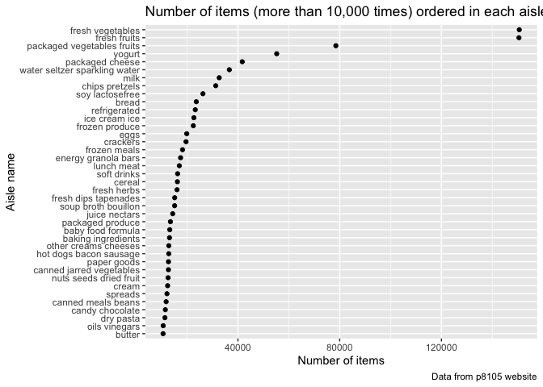
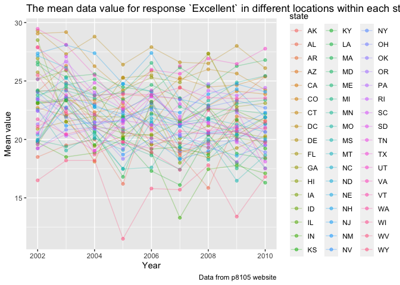
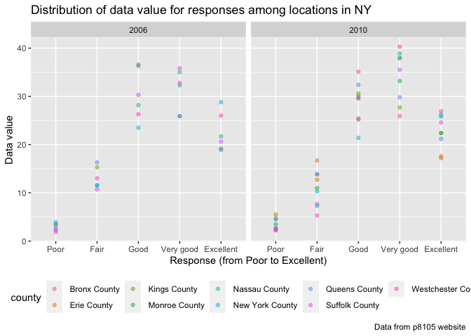

p8105\_hw3\_ws2646
================
Weize Sun
10/20/2021

``` r
library(tidyverse)
```

    ## ── Attaching packages ─────────────────────────────────────── tidyverse 1.3.1 ──

    ## ✓ ggplot2 3.3.5     ✓ purrr   0.3.4
    ## ✓ tibble  3.1.4     ✓ dplyr   1.0.7
    ## ✓ tidyr   1.1.3     ✓ stringr 1.4.0
    ## ✓ readr   2.0.1     ✓ forcats 0.5.1

    ## ── Conflicts ────────────────────────────────────────── tidyverse_conflicts() ──
    ## x dplyr::filter() masks stats::filter()
    ## x dplyr::lag()    masks stats::lag()

## Problem 1

``` r
library(p8105.datasets)
data("instacart")
```

``` r
nrow(instacart)
```

    ## [1] 1384617

``` r
ncol(instacart)
```

    ## [1] 15

``` r
skimr::skim(instacart)
```

|                                                  |           |
|:-------------------------------------------------|:----------|
| Name                                             | instacart |
| Number of rows                                   | 1384617   |
| Number of columns                                | 15        |
| \_\_\_\_\_\_\_\_\_\_\_\_\_\_\_\_\_\_\_\_\_\_\_   |           |
| Column type frequency:                           |           |
| character                                        | 4         |
| numeric                                          | 11        |
| \_\_\_\_\_\_\_\_\_\_\_\_\_\_\_\_\_\_\_\_\_\_\_\_ |           |
| Group variables                                  | None      |

Data summary

**Variable type: character**

| skim\_variable | n\_missing | complete\_rate | min | max | empty | n\_unique | whitespace |
|:---------------|-----------:|---------------:|----:|----:|------:|----------:|-----------:|
| eval\_set      |          0 |              1 |   5 |   5 |     0 |         1 |          0 |
| product\_name  |          0 |              1 |   3 | 159 |     0 |     39123 |          0 |
| aisle          |          0 |              1 |   3 |  29 |     0 |       134 |          0 |
| department     |          0 |              1 |   4 |  15 |     0 |        21 |          0 |

**Variable type: numeric**

| skim\_variable            | n\_missing | complete\_rate |       mean |        sd |  p0 |    p25 |     p50 |     p75 |    p100 | hist  |
|:--------------------------|-----------:|---------------:|-----------:|----------:|----:|-------:|--------:|--------:|--------:|:------|
| order\_id                 |          0 |              1 | 1706297.62 | 989732.65 |   1 | 843370 | 1701880 | 2568023 | 3421070 | ▇▇▇▇▇ |
| product\_id               |          0 |              1 |   25556.24 |  14121.27 |   1 |  13380 |   25298 |   37940 |   49688 | ▆▆▇▆▇ |
| add\_to\_cart\_order      |          0 |              1 |       8.76 |      7.42 |   1 |      3 |       7 |      12 |      80 | ▇▁▁▁▁ |
| reordered                 |          0 |              1 |       0.60 |      0.49 |   0 |      0 |       1 |       1 |       1 | ▆▁▁▁▇ |
| user\_id                  |          0 |              1 |  103112.78 |  59487.15 |   1 |  51732 |  102933 |  154959 |  206209 | ▇▇▇▇▇ |
| order\_number             |          0 |              1 |      17.09 |     16.61 |   4 |      6 |      11 |      21 |     100 | ▇▂▁▁▁ |
| order\_dow                |          0 |              1 |       2.70 |      2.17 |   0 |      1 |       3 |       5 |       6 | ▇▂▂▂▆ |
| order\_hour\_of\_day      |          0 |              1 |      13.58 |      4.24 |   0 |     10 |      14 |      17 |      23 | ▁▃▇▇▃ |
| days\_since\_prior\_order |          0 |              1 |      17.07 |     10.43 |   0 |      7 |      15 |      30 |      30 | ▅▅▃▂▇ |
| aisle\_id                 |          0 |              1 |      71.30 |     38.10 |   1 |     31 |      83 |     107 |     134 | ▆▃▃▇▆ |
| department\_id            |          0 |              1 |       9.84 |      6.29 |   1 |      4 |       8 |      16 |      21 | ▇▂▂▅▂ |

### Short discription of the dataset

This dataset contains 1384617 rows of observations and 15 columns of
variables. The structure is, each row represents one order of one
product by one user from an online grocery store “Instacart”.

The 15 variables are order\_id, product\_id, add\_to\_cart\_order,
reordered, user\_id, eval\_set, order\_number, order\_dow,
order\_hour\_of\_day, days\_since\_prior\_order, product\_name,
aisle\_id, department\_id, aisle, department .

### Describing some key variables

``` r
mean(pull(instacart, reordered))
```

    ## [1] 0.5985944

``` r
names(sort(table(pull(instacart, order_hour_of_day)), decreasing = TRUE))[1]
```

    ## [1] "14"

``` r
mean(pull(instacart, days_since_prior_order))
```

    ## [1] 17.06613

``` r
names(sort(table(pull(instacart, product_name)), decreasing = TRUE))[1]
```

    ## [1] "Banana"

I found there are 4 variables are important.

The first one is `reordered`, which represents if the order has been
ordered or not.

The mean of `reordered` is 0.5985944, which means about 59.86% of the
orders has been reordered.

The second one is `order_hour_of_day`, which shows the hour of a day
when a user placed that order.

Most of the users placed order in 14, which is 2 pm.

The third one is `days_since_prior_order`, which means after how many
days the users placed another order.

The mean of `days_since_prior_order` is 17.06613, which means users
often placed another order after about 17 days.

The fourth one is `product_name`, which shows the name of a product.

Banana has been the most product the users ordered.

### Example of observation

``` r
instacart[10,] %>% 
  knitr::kable()
```

| order\_id | product\_id | add\_to\_cart\_order | reordered | user\_id | eval\_set | order\_number | order\_dow | order\_hour\_of\_day | days\_since\_prior\_order | product\_name | aisle\_id | department\_id | aisle                         | department |
|----------:|------------:|---------------------:|----------:|---------:|:----------|--------------:|-----------:|---------------------:|--------------------------:|:--------------|----------:|---------------:|:------------------------------|:-----------|
|        36 |       19660 |                    2 |         1 |    79431 | train     |            23 |          6 |                   18 |                        30 | Spring Water  |       115 |              7 | water seltzer sparkling water | beverages  |

I chose the 10th row from this dataset. It shows that this user ordered
Spring Water from aisle “water seltzer sparkling water” at aisle 115
from department beverages. This user placed this order at 6 pm on
Saturday, and it has been 30 days since this user’s last order.

### About aisles

``` r
length(unique(pull(instacart, aisle)))
```

    ## [1] 134

``` r
names(sort(table(pull(instacart, aisle)), decreasing = TRUE)) [1]
```

    ## [1] "fresh vegetables"

There are 134 unique aisles, of which fresh vegetables was the most
ordered item from.

``` r
aisle_plot = 
  instacart %>% 
  count(aisle, name = "number_of_items") %>% 
  filter(number_of_items > 10000)  %>% 
  ggplot(aes(reorder(aisle, number_of_items), x = number_of_items)) +
  geom_point()+
  labs(
    title = "Number of items (more than 10,000 times) ordered in each aisle",
    x = "Number of items",
    y = "Aisle name",
    caption = "Data from p8105 website"
  )
aisle_plot
```

<!-- -->

### Popular items in aisles

``` r
three_pop_items_df = 
  instacart %>% 
  select(aisle, product_name) %>% 
  filter(aisle == "baking ingredients" | aisle == "dog food care" | aisle == "packaged vegetables fruits") %>%           
  group_by(aisle, product_name) %>%
  summarize(order_times = n()) %>%
  arrange(desc(order_times)) %>%
  mutate(product_rank = min_rank(desc(order_times))) %>% 
  filter(product_rank <= 3)
```

    ## `summarise()` has grouped output by 'aisle'. You can override using the `.groups` argument.

``` r
knitr::kable(three_pop_items_df)
```

| aisle                      | product\_name                                 | order\_times | product\_rank |
|:---------------------------|:----------------------------------------------|-------------:|--------------:|
| packaged vegetables fruits | Organic Baby Spinach                          |         9784 |             1 |
| packaged vegetables fruits | Organic Raspberries                           |         5546 |             2 |
| packaged vegetables fruits | Organic Blueberries                           |         4966 |             3 |
| baking ingredients         | Light Brown Sugar                             |          499 |             1 |
| baking ingredients         | Pure Baking Soda                              |          387 |             2 |
| baking ingredients         | Cane Sugar                                    |          336 |             3 |
| dog food care              | Snack Sticks Chicken & Rice Recipe Dog Treats |           30 |             1 |
| dog food care              | Organix Chicken & Brown Rice Recipe           |           28 |             2 |
| dog food care              | Small Dog Biscuits                            |           26 |             3 |

This is the table showing the most popular three items in aisles
“packaged vegetables fruits”, “baking ingredients”, and “dog food care”.

Under aisle “packaged vegetables fruits”, Organic Baby Spinach is the
most popular item, which has been ordered 9784 times; Organic
Raspberries is the second popular item, which has been ordered 5546
times; Organic Blueberries is the third popular item, which has been
ordered 4966 times.

Under aisle “baking ingredients”, Light Brown Sugar is the most popular
item, which has been ordered 499 times; Pure Baking Soda is the second
popular item, which has been ordered 387 times; Pure Baking Soda is the
third popular item, which has been ordered 336 times.

Under aisle “dog food care”, Snack Sticks Chicken & Rice Recipe Dog
Treats is the most popular item, which has been ordered 30 times;
Organic Chicken & Brown Rice Recipe is the second popular item, which
has been ordered 28 times; Small Dog Biscuits is the third popular item,
which has been ordered 26 times.

### Mean order hour of items

``` r
hour_df = 
  instacart %>% 
  select(order_dow, order_hour_of_day, product_name) %>% 
  filter(product_name == "Pink Lady Apples" | product_name == "Coffee Ice Cream") %>% 
  group_by(order_dow, product_name) %>% 
  summarize(mean_hour = mean(order_hour_of_day)) %>% 
  pivot_wider(
    names_from = "order_dow",
    values_from = "mean_hour"
  ) %>% 
  rename("Sunday" = "0", "Monday" = "1", "Tuesday" = "2", "Wednesday" = "3", "Thursday" = "4",
         "Friday" = "5", "Saturday" = "6") 
```

    ## `summarise()` has grouped output by 'order_dow'. You can override using the `.groups` argument.

``` r
knitr::kable(hour_df)
```

| product\_name    |   Sunday |   Monday |  Tuesday | Wednesday | Thursday |   Friday | Saturday |
|:-----------------|---------:|---------:|---------:|----------:|---------:|---------:|---------:|
| Coffee Ice Cream | 13.77419 | 14.31579 | 15.38095 |  15.31818 | 15.21739 | 12.26316 | 13.83333 |
| Pink Lady Apples | 13.44118 | 11.36000 | 11.70213 |  14.25000 | 11.55172 | 12.78431 | 11.93750 |

This is the table showing the mean order hour of a day at which Pink
Lady Apples and Coffee Ice Cream are ordered on each day of the week.
From this table, we can see that in general Pink Lady Apples is ordered
earlier in a day than Coffee Ice Cream.

## Problem 2

``` r
library(p8105.datasets)
data("brfss_smart2010")
```

### Cleaning data

``` r
brfss_clean = 
  brfss_smart2010 %>% 
  janitor::clean_names() %>% 
  select(-locationabbr) %>% 
  separate(locationdesc, into = c("state", "county"), sep = "-") %>% 
  filter(topic == "Overall Health", response == "Poor" | response == "Fair" | response == "Good" | 
           response == "Very Good" | response == "Excellent") %>% 
  mutate(response = factor(response, levels = c("Poor", "Fair", "Good", "Very good", "Excellent"), ordered = TRUE)) %>% 
  arrange(response)
```

    ## Warning: Expected 2 pieces. Additional pieces discarded in 500 rows [4211, 4212,
    ## 4213, 4214, 4215, 4216, 4217, 4218, 4219, 4220, 4221, 4222, 4223, 4224, 4225,
    ## 4226, 4227, 4228, 4229, 4230, ...].

``` r
brfss_clean
```

    ## # A tibble: 8,500 × 23
    ##     year state county   class  topic  question   response sample_size data_value
    ##    <int> <chr> <chr>    <chr>  <chr>  <chr>      <ord>          <int>      <dbl>
    ##  1  2010 "AL " " Jeffe… Healt… Overa… How is yo… Poor              45        5.5
    ##  2  2010 "AL " " Mobil… Healt… Overa… How is yo… Poor              66        6.4
    ##  3  2010 "AL " " Tusca… Healt… Overa… How is yo… Poor              35        4.2
    ##  4  2010 "AZ " " Maric… Healt… Overa… How is yo… Poor              62        3.5
    ##  5  2010 "AZ " " Pima … Healt… Overa… How is yo… Poor              49        5.7
    ##  6  2010 "AZ " " Pinal… Healt… Overa… How is yo… Poor              30        4  
    ##  7  2010 "AR " " Bento… Healt… Overa… How is yo… Poor              21        3  
    ##  8  2010 "AR " " Pulas… Healt… Overa… How is yo… Poor              36        3.8
    ##  9  2010 "AR " " Washi… Healt… Overa… How is yo… Poor              16        2.4
    ## 10  2010 "CA " " Alame… Healt… Overa… How is yo… Poor              23        2.4
    ## # … with 8,490 more rows, and 14 more variables: confidence_limit_low <dbl>,
    ## #   confidence_limit_high <dbl>, display_order <int>, data_value_unit <chr>,
    ## #   data_value_type <chr>, data_value_footnote_symbol <chr>,
    ## #   data_value_footnote <chr>, data_source <chr>, class_id <chr>,
    ## #   topic_id <chr>, location_id <chr>, question_id <chr>, respid <chr>,
    ## #   geo_location <chr>

### Answering question

``` r
brfss_2002 = 
  filter(brfss_clean, year == 2002) %>% 
  group_by(state) %>% 
  summarize(observed = n_distinct(county)) %>%
  filter(observed >= 7)

brfss_2010 = 
  filter(brfss_clean, year == 2010) %>% 
  group_by(state) %>% 
  summarize(observed = n_distinct(county)) %>%
  filter(observed >= 7)

brfss_2002
```

    ## # A tibble: 6 × 2
    ##   state observed
    ##   <chr>    <int>
    ## 1 "CT "        7
    ## 2 "FL "        7
    ## 3 "MA "        8
    ## 4 "NC "        7
    ## 5 "NJ "        8
    ## 6 "PA "       10

``` r
brfss_2010
```

    ## # A tibble: 14 × 2
    ##    state observed
    ##    <chr>    <int>
    ##  1 "CA "       12
    ##  2 "CO "        7
    ##  3 "FL "       41
    ##  4 "MA "        9
    ##  5 "MD "       12
    ##  6 "NC "       12
    ##  7 "NE "       10
    ##  8 "NJ "       19
    ##  9 "NY "        9
    ## 10 "OH "        8
    ## 11 "PA "        7
    ## 12 "SC "        7
    ## 13 "TX "       16
    ## 14 "WA "       10

In 2002, there are 6 states with equal to or more than 7 observed
counties. They are CT, FL, MA, NC, NJ, and PA.

In 2010, there are 14 states with equal to or more than 7 observed
counties. They are CA, CO, FL, MA, MD, NC, NE, NJ, NY, OH, PA, SC, TX,
and WA.

``` r
excellent_rsp = 
  filter(brfss_clean, response == "Excellent") %>% 
  group_by(year, state) %>% 
  select(year, state, data_value) %>% 
  summarize(mean_value = mean(data_value))
```

    ## `summarise()` has grouped output by 'year'. You can override using the `.groups` argument.

``` r
ggplot(excellent_rsp, aes(x = year, y = mean_value, color = state)) +
  geom_point(alpha = .5) +
  geom_line(alpha = .3) +
  labs(
    title = "The mean data value for response `Excellent` in different locations within each state",
    x = "Year",
    y = "Mean value",
    caption = "Data from p8105 website"
  )
```

    ## Warning: Removed 4 rows containing missing values (geom_point).

    ## Warning: Removed 3 row(s) containing missing values (geom_path).

<!-- -->

``` r
brfss_06_10 = 
  brfss_smart2010 %>% 
  janitor::clean_names() %>% 
  filter(locationabbr == "NY") %>%
  separate(locationdesc, into = c("state", "county"), sep = "-") %>%
  select(-locationabbr) %>% 
  filter(topic == "Overall Health", response == "Poor" | response == "Fair" | response == "Good" | response == "Very good" | response == "Excellent") %>% 
  mutate(response = factor(response, levels = c("Poor", "Fair", "Good", "Very good", "Excellent"), ordered = TRUE)) %>%  #I don't know why brfss_clean doesn't work for me, so I have to do this over again.
  filter(year == 2006 | year == 2010) %>% 
  select(year, state, county, response, data_value) 

ggplot(brfss_06_10, aes(x = response, y = data_value, color = county))+
  geom_point(alpha = .5)+
  facet_grid(. ~ year)+
  labs(
    title = "Distribution of data value for responses among locations in NY",
    x = "Response (from Poor to Excellent)",
    y = "Data Value",
    caption = "Data from p8105 website"
  )+
  theme(legend.position = "bottom")
```

<!-- -->
